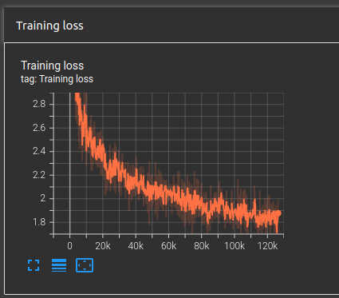

# Image-captioning

This rebo is a pytorch implementation of [Show, Attend and Tell: Neural Image Caption Generation with Visual Attention](https://arxiv.org/abs/1502.03044) on [Flickr 8k Dataset](https://www.kaggle.com/datasets/adityajn105/flickr8k)  which consists of 8,000 images that are each paired with five different captions which provide clear descriptions of the salient entities and events.

# Setup And Inference
Code is developed under following library dependencies
```commandline
python 3.7
torch 1.10.1
torchtext 0.11.1
torchvision 0.11.2
```
Start with creating a virtual environment then open your terminal and follow the following steps:
```commandline
git clone "https://github.com/zaghlol94/Image-captioning"
cd Image-captioning
pip install -r requirements.txt
bash download_assets.sh
cd src
python inference.py -i "image path"
```
# Data-Set
Flickr8k consists of 8,000 images that are each paired with five different captions which provide clear descriptions of the salient entities and events.
you could download the dataset from [here](https://www.kaggle.com/datasets/adityajn105/flickr8k).
```commandline
├── captions.txt
└── Images
    ├── 10815824_2997e03d76.jpg
    ├── 12830823_87d2654e31.jpg
    ├── 17273391_55cfc7d3d4.jpg
    ├── 19212715_20476497a3.jpg
    ├── 3637013_c675de7705.jpg
    └── 667626_18933d713e.jpg

```
There is Images folder contains all the images and caption file consist of two columns, the first columns is the name of the image and the second columns is the caption.

# Train
To train the model on custom data-set of different image-caption pair, you could add your data files in the same structure described in the previous section and 
change the root folder/caption files' path in [config.py](https://github.com/zaghlol94/Image-captioning/blob/main/src/config.py)
then follow the following steps in the command line:
```commandline
cd src
python train.py
```
After these steps you will find ```my_checkpoint.pth.tar``` in src folder, which is the weights of the seq2sq model.
### loss
you could figure out how the loss declined over epochs using tensorboard by writing in the command line:
```commandline
tensorboard --logdir=runs/ 
then go to http://localhost:6006/
```

# Citation
```commandline
@misc{https://doi.org/10.48550/arxiv.1502.03044,
  doi = {10.48550/ARXIV.1502.03044},
  
  url = {https://arxiv.org/abs/1502.03044},
  
  author = {Xu, Kelvin and Ba, Jimmy and Kiros, Ryan and Cho, Kyunghyun and Courville, Aaron and Salakhutdinov, Ruslan and Zemel, Richard and Bengio, Yoshua},
  
  keywords = {Machine Learning (cs.LG), Computer Vision and Pattern Recognition (cs.CV), FOS: Computer and information sciences, FOS: Computer and information sciences},
  
  title = {Show, Attend and Tell: Neural Image Caption Generation with Visual Attention},
  
  publisher = {arXiv},
  
  year = {2015},
  
  copyright = {arXiv.org perpetual, non-exclusive license}
}

```